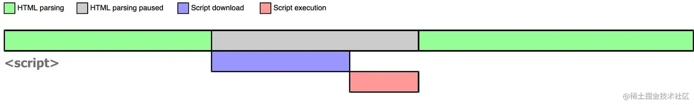
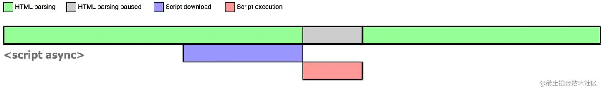
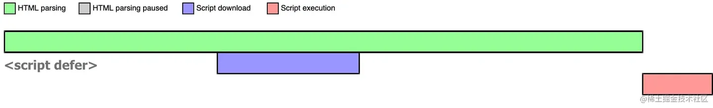

# 一、web性能

## 1.1 什么是web性能
Web 性能是对网站或应用程序的客观度量和用户的体验。这包括以下主要方面
* 减少总体负载时间
* 尽快使网站可用
* 流畅性和交互性

许多特性都会影响性能。包括延迟、应用程序大小、DOM 节点数量、资源请求数量、JavaScript 性能、CPU 负载等等。重要的是尽量缩短加载和响应时间，并通过增加额外的功能来隐藏延迟：先使网站变得可以交互，同时在后台加载用户体验中的次要部分。

## 1.2 为什么关心web性能
两个很重要的点，一是很多地方流量是很贵的，二是减少网站的下载和渲染时间可以提高转化率和用户留存

* 22.6 MB 的 CNN.com 体验可能需要印度平均工资的 11% 才能下载。在西北非洲的移动设备上，可能需要两天的平均工资。如果这个网站在美国运营商的国际漫游计划上加载呢？费用会让任何人都流泪。（参见[下载你的网站需要多少费用](https://whatdoesmysitecost.com/)。）
* 以下是一些现实世界中的性能改进示例：
  * Tokopedia 将 3G 连接的渲染时间从 14 秒减少到 2 秒，访问者增加了 19%，总会话数增加了 35%，新用户增加了 7%，活跃用户增加了 17% ，每位用户的会话数增加了 16%。
  * Pinterest 页面重建以提高性能，导致等待时间减少了 40%，SEO 流量增加了 15%，注册转化率增加了 15%。

Web 性能对于可访问性以及服务于组织或企业目标的其他网站指标非常重要。网站性能的好坏与用户体验以及大多数网站的整体效果密切相关。这就是为什么你应该关心 web 性能。

## 1.3 了解性能之前需要掌握哪些
* 了解浏览器的工作原理（渲染，很重要的一点页面的展示是渐进性的，一般解析一个dom就会显示一个）
* 源顺序
* 关键路径
* 文档对象模型
* 延迟
* [load](https://developer.mozilla.org/zh-CN/docs/Web/API/Window/load_event)、[DOMContentLoaded](https://developer.mozilla.org/zh-CN/docs/Web/API/Document/DOMContentLoaded_event)

## 1.4 性能测量
有几种不同的工具可用于帮助你测量和改进性能。这些工具通常可以分为两类：
* 通用性能的工具
* 你可以用来构建自定义性能工具的[性能 API](https://developer.mozilla.org/zh-CN/docs/Web/API/Performance_API)

### 1.4.1 通用性能工具
* 像 [PageSpeed Insights](https://pagespeed.web.dev/) 这样的工具可以衡量网站的性能。你可以输入一个 URL，并在几秒钟内获得一份性能报告。
* 网络监视工具：大多数浏览器都有可用的工具，你可以使用这些工具来针对已加载的页面进行运行，以确定它们的性能如何，大多数工具的工作方式都很类似。你还可以查看 [Chrome 的网络监视器文档](https://developer.chrome.com/docs/devtools/network/)
* 性能监视工具：你也可以使用浏览器性能监测工具，比如[Chrome 性能工具](https://developer.chrome.com/docs/devtools/performance/)文档来测量在执行不同操作时一个 web 应用或网站的用户界面性能。这可以指出可能拖慢你的 web 应用或网站速度的特性

### 1.4.2 性能 API
编写 web 代码时，有[Performance API](https://developer.mozilla.org/zh-CN/docs/Web/API/Performance_API) 可用，使你可以创建自己的性能测量工具

# 二、性能优化

## 2.1 js性能优化
### 2.1.1 优化js下载
---
原则上是减少js的代码体积。最高效、最不阻塞的 JavaScript 是根本不使用 JavaScript。你应该尽量少使用 JavaScript。我们要知道一点，script引入js（包括外部引入）标签既会阻塞页面渲染,也会阻塞DOM解析。考虑一下几点
* 并非总是需要框架
* 考虑更简单的解决方案
* 删除未使用的代码
* 考虑使用浏览器内置特性
  * 使用内置的客户端表单验证。
  * 使用浏览器自带的 video 播放器。
  * 使用 CSS 动画而不是 JavaScript 动画库（参见[处理动画](https://developer.mozilla.org/zh-CN/docs/Learn/Performance/JavaScript#%E5%A4%84%E7%90%86_javascript_%E5%8A%A8%E7%94%BB)）
为了逻辑清晰应该将js代码按逻辑分散到多个文件中，使用js模块化来整合。在打包的时候使用 [Webpack](https://webpack.js.org/)等打包工具对代码体积进行压缩，并在传输的时候使用[Gzip](https://developer.mozilla.org/zh-CN/docs/Glossary/GZip_compression) 压缩进一步压缩文件，即使你不对代码进行压缩也应该使用。[Brotli](https://developer.mozilla.org/zh-CN/docs/Glossary/Brotli_compression) 压缩类似于 Gzip，但通常优于 Gzip 压缩。
### 2.1.2 关键资源加载
---
如果某个脚本非常重要，并且你担心由于加载速度不够快而影响性能，你可以在文档的head标签中加载它，这样浏览器会尽快下载它，并尽快执行它。
这个方法可以正常工作，但会阻塞渲染。更好的策略是使用 rel="preload" 来为关键 JavaScript 创建一个预加载器：
```html
<head>
  <!-- 预加载 JavaScript 文件 -->
  <link rel="preload" href="important-js.js" as="script" />
  <!-- 预加载 JavaScript 模块 -->
  <link rel="modulepreload" href="important-module.js" />
</head>
```
预加载的link 尽快获取 JavaScript，而不会阻塞渲染。然后，你可以在页面中任何位置使用它：
```html
<!-- 在合适的位置包含该脚本 -->
<script src="important-js.js"></script>
<script type="module" src="important-module.js">
   // 或者在脚本中使用它（在使用 JavaScript 模块的情况下）：
   import { function } from "important-module.js";  
</script>
```
⚠️：*预加载并不能保证脚本在你包含它时已经加载完成，但它确实意味着它将尽早开始下载。即使未完全移除阻塞渲染的时间，渲染阻塞时间仍将缩短。*

---
另一方面，你应该尽量推迟解析和执行非关键 JavaScript 的时间，直到它真正需要时再加载。提前加载它会不必要地阻塞渲染。
可以在script标签上加 async、 defer属性



通过上面的图，我们可以知道 script标签上加了async属性，浏览器会立即下载js文件，但不会阻塞html解析，等js文件下载完成后，会立即执行js文件，会阻塞html解析，直到js执行结束，html继续解析。async和 DOMContentLoaded 无任何绑定关系。

而script标签上加了defer属性，浏览器同样会立即下载js文件，不会阻塞html解析，等js文件下载后不会立即执行js文件，而是等待html解析完成后，但在触发 DOMContentLoaded 事件之前执行。[async、defer](https://zhuanlan.zhihu.com/p/622763093?utm_id=0)

### 2.1.3 高效代码编写技巧

* 事件处理尽量使用事件委托，事件监听器越少越好，结束后记得删除监听器
* 减少 DOM 操作：访问和更新 DOM 的计算成本很高，因此你应该尽量减少 JavaScript 这种操作方面的操作量，特别是在执行持续的 DOM 动画时
* 批量进行 DOM 更改
* 一个有用的技巧是，当你有大量 HTML 代码要添加到页面时，先构建整个片段（通常在 [DocumentFragment](https://developer.mozilla.org/zh-CN/docs/Web/API/DocumentFragment) 内部），然后一次性将其附加到 DOM 中，而不是逐个附加每个项目
* 减少循环代码的数量
* 将计算任务移到主线程之外
  * 使用异步代码
  * 在 [Web Worker](https://developer.mozilla.org/zh-CN/docs/Web/API/Web_Workers_API/Using_web_workers) 中进行计算：在 worker 线程中你可以运行任何你喜欢的代码，不过有一些例外情况。比如：在 worker 内，不能直接操作 DOM 节点，也不能使用 window 对象的默认方法和属性。但是你可以使用大量 window 对象之下的东西，包括 WebSockets，以及 IndexedDB 等数据存储机制。
  * 使用 [WebGPU](https://developer.mozilla.org/zh-CN/docs/Web/API/WebGPU_API):webgl 的继任者，javascript 可以直接操作显卡，解决了一些webgl的问题，速度更快，但是兼容性差
* [优化长任务](https://juejin.cn/post/7155151495694909447)

## 2.2 html性能优化
就性能而言，HTML 非常简单，它主要是文本，文本大小较小，因此下载和渲染速度通常很快。影响网页性能的关键问题包括：

* 图像和视频文件的大小：替换元素img、video 
* 嵌入内容
* 资源加载

### 2.2.1 图片优化
---
#### 通过 srcset 提供不同的图像分辨率
要根据设备的分辨率和视口大小提供相同图像的不同分辨率版本，你可以利用 srcset 和 sizes 这两个属性。

如下，根据设备像素比，浏览器会自动选择最合适的图像。
```html

```
1.5x、2x 等是相对分辨率指示器。如果图像的样式设置为 320px 宽（例如在 CSS 中使用 width: 320px），则如果设备分辨率较低（每个 CSS 像素对应一个设备像素），浏览器将加载 1.jpg，如果设备分辨率较高（每个 CSS 像素对应两个或更多设备像素），则加载 3.jpg

如下，根据不同屏幕宽度提供了不同尺寸的图像。
```html

```
*⚠️在这两种情况下，src 属性在浏览器不支持 src/srcset 的情况下提供了默认图像。*

#### 使用picture和source标签
picture元素基于传统的img元素，允许你为不同的情况提供多个不同的源。
上一节介绍了单一的通过像素或视口大小来切换图片源，使用picture和source标签与srcset组合使用提供了更灵活的解决方案。

如下
```html
<picture>
  <source media="(max-width: 799px)" srcset="1.jpg, 2.jpg 2x" />
  <source media="(min-width: 800px)" srcset="3.jpg, 4.jpg 2x" />
  
</picture>
 ```
source 元素在 media 属性中包含媒体查询。如果媒体查询返回 true，则加载其 source 元素的 srcset 属性中引用的图像。在上面的示例中，如果视口宽度为 799px 或更小，则加载 narrow-banner-480w.jpg 图像。还要注意 picture 元素包含了一个 img 元素，在不支持 picture 的浏览器中提供了默认图像加载。配合srcset可以提供多种分辨率图像。

#### 图像的懒加载
懒加载就是资源出现在视口时才会加载，这对于一个页面中有很多图片的网站来说，是非常有用的。浏览器不会浪费带宽加载用户永远看不到的图像。
懒加载通常使用 JavaScript 处理，但现在浏览器有一个可用的 loading 属性，可以指示浏览器自动进行图像的懒加载：
```html

```
详细信息请参见 [web图像懒加载](https://web.dev/articles/browser-level-image-lazy-loading)

### 2.2.2 视频优化
#### 为视频提供不同来源
视频优化与图像优化非常相似。
```html
<video controls>
  <source src="video/smaller.mp4" type="video/mp4" />
  <source src="video/smaller.webm" type="video/webm" />
  <source src="video/larger.mp4" type="video/mp4" media="(min-width: 800px)" />
  <source
    src="video/larger.webm"
    type="video/webm"
    media="(min-width: 800px)" />

  <!-- 在不支持 video 元素的浏览器中的备用 -->
  <a href="video/larger.mp4">下载视频</a>
</video>
```
然而，提供图像和视频的源之间存在一些关键差异：

* 在上面的示例中，我们使用的是 src 而不是 srcset；你无法通过 srcset 指定视频的不同分辨率。
* 相反，要在不同的 source 元素中指定了不同的分辨率。
* 请注意，我们还在不同的 source 元素中指定了不同的视频格式，每个格式都在 type 属性中通过其 MIME 类型进行标识。浏览器将加载它们支持（媒体查询测试返回 true）的首个格式。

#### 视频的延迟加载
将 preload 的值设置为 none 告诉浏览器在用户决定播放视频之前不要预加载任何视频数据，这对性能显然是有益的。相反，它只会显示由 poster 属性指示的图像。不同的浏览器具有不同的默认视频加载行为，因此最好明确指定。

```html
<video controls preload="none" poster="poster.jpg">
  <source src="video.webm" type="video/webm" />
  <source src="video.mp4" type="video/mp4" />
</video>
```
[详细信息请参见](https://web.dev/articles/lazy-loading-video)

### 2.2.3 嵌入内容
在网页中嵌入来自其他来源的内容非常常见。这通常在网站上显示广告以产生收入时使用，广告通常由第三方公司生成并嵌入到你的页面中。

嵌入内容最常用的方式是使用 iframe 元素，尽管还存在其他不太常用的嵌入元素，如 object 和 embed标签。在本节中，我们将重点关注 iframe。

使用 iframe 方面的最重要也是最关键的建议是：“除非非常必要，否则不要使用嵌入式 iframe”。

优点

* 简单
* 隔离
* 安全

缺点

* 布局约束
* 性能开销
* 破坏了语义化，对无障碍可访问性支持不好哦
* 不利于seo，会当成2个页面
* url 不同步。浏览器刷新 iframe url 状态丢失、后退前进按钮无法使用。
* UI 不同步，DOM 结构不共享。想象一下屏幕右下角 1/4 的 iframe 里来一个带遮罩层的弹框，同时我们要求这个弹框要浏览器居中显示，还要浏览器 resize 时自动居中..
* 全局上下文完全隔离，内存变量不共享。iframe 内外系统的通信、数据同步等需求，主* 应用的 cookie 要透传到根域名都不同的子应用中实现免登效果。
* 慢。每次子应用进入都是一次浏览器上下文重建、资源重新加载的过程。

像聚合多个应用的场景，建议使用 single-spa 这类微前端框架。（例如[qiankun](https://qiankun.umijs.org/zh)）

非要使用 iframe 的话，建议与img元素一样，你还可以使用 loading 属性指示浏览器对最初屏幕外的 iframe 内容进行懒加载，从而提高性能：

```html
<iframe src="https://example.com" loading="lazy" width="600" height="400">
</iframe>
```

详情请参阅 [延迟加载屏外iframe](https://web.dev/articles/iframe-lazy-loading)

### 2.2.4 资源预加载
从 HTML、CSS 和 JavaScript 中链接到的其他资源（如图像、视频或字体文件）的获取也可能导致性能问题，阻塞代码的执行并减慢体验速度。一种缓解此类问题的方法是使用 rel="preload" 将 link 元素转换为预加载器。例如：
```html
<link rel="preload" href="sintel-short.mp4" as="video" type="video/mp4" />
```
更多参考 [预加载核心资源](https://web.dev/articles/preload-critical-assets?hl=zh-cn)

## 2.3 css性能优化

浏览器有一个固定的渲染流程——只有在布局（layout）完成后才能绘制（paint）页面，而布局的前提是要生成渲染树（render tree），而渲染树的生成则需要 DOM 和 CSSOM 树的配合。

如果先让用户看到一个没有样式的页面，等 CSS 样式解析完后再重绘（repaint），这样的体验会很差。所以，浏览器会等到确定需要 CSS 时才开始渲染。只有在下载完 CSS 并生成 CSS 对象模型 CSS 对象模型（CSSOM）之后，浏览器才会绘制页面。

### 2.3.1 基础优化

* 删除不必要的样式
* 将 CSS 拆分为独立模块

```html
<!-- 加载和解析 styles.css 会阻塞渲染 -->
<link rel="stylesheet" href="styles.css" />

<!-- 加载和解析 print.css 不会阻塞渲染 -->
<link rel="stylesheet" href="print.css" media="print" />

<!-- 在大屏幕上，加载和解析 mobile.css 不会阻塞渲染 -->
<link
  rel="stylesheet"
  href="mobile.css"
  media="screen and (max-width: 480px)" />
```
* 最小化和压缩你的 CSS: 同js一样，打包时压缩，同时在传输时压缩
* 简化选择器
* 使用 CSS 精灵图减少图像相关的 HTTP 请求：[CSS 精灵图](https://css-tricks.com/css-sprites/)是一种技术，它将你希望在站点上使用的多个小图像（例如图标）放入单个图像文件中，然后使用不同的 background-position 值在不同的位置显示图像的一部分。这可以大大减少获取图像所需的 HTTP 请求数量。
* 预加载重要资源: 你可以使用 rel="preload" 将 <link> 元素转换为预加载器，用于关键资源，包括 CSS 文件、字体和图片

```html
<link rel="preload" href="style.css" as="style" />
<link
  rel="preload"
  href="ComicSans.woff2"
  as="font"
  type="font/woff2"
  crossorigin />
<link
  rel="preload"
  href="bg-image-wide.png"
  as="image"
  media="(min-width: 601px)" />
```

### 2.3.2 css动画
页面中的动画效果，是让用户体验更好的体现，也是吸引用户的一个重点。但是使用js处理动画的性能较差，能使用css实现的尽量使用css实现。

#### 了解动画的处理
某些属性在进行动画处理时会触发回流（进一步也会触发重绘），应该避免使用这些属性。这些属性包括：
* 修改元素的尺寸，例如 width、height、border 和 padding。
* 重新定位元素，例如 margin、top、bottom、left 和 right。
* 更改元素的布局，例如 align-content、align-items 和 flex。
* 添加改变元素几何形状的视觉效果，例如 box-shadow。

不会引起回流/重绘的属性进行动画处理。这包括：
* [Transforms](https://developer.mozilla.org/zh-CN/docs/Web/CSS/CSS_transforms)
* [opacity](https://developer.mozilla.org/zh-CN/docs/Web/CSS/opacity)
* [filter](https://developer.mozilla.org/zh-CN/docs/Web/CSS/filter)

#### 在 GPU 上进行动画处理
为了进一步提高性能，你应该考虑将动画处理工作转移到主线程之外，并放到设备的 GPU 上进行
* 3D 变换动画: 例如 [transform: translateZ()](https://developer.mozilla.org/zh-CN/docs/Web/CSS/transform) 和 [rotate3d()](https://developer.mozilla.org/zh-CN/docs/Web/CSS/transform-function/rotate3d)。
* 特定的在其自己层中渲染的元素包括 video、canvas 和 iframe。
* 应用了 [will-change](https://developer.mozilla.org/zh-CN/docs/Web/CSS/will-change) 的元素: 浏览器可能会在元素实际发生变化之前进行优化设置。这类优化可以通过提前完成可能需要的大量工作，提高页面的响应速度。CSS 的 will-change 属性向浏览器提示元素预期的变化方式。

*⚠️谨慎使用。浏览器进行的优化通常是在尽可能短的时间内删除优化并恢复到正常状态。但是，将 will-change 直接添加到样式表中意味着目标元素通常会在不久的将来发生变化，而浏览器会保留优化更长的时间。因此，最好的做法是在更改发生之前和之后使用脚本代码开启和关闭 will-change*

```js
const el = document.getElementById("element");
// 当鼠标移动到该元素上时给该元素设置 will-change 属性
el.addEventListener("mouseenter", hintBrowser);
el.addEventListener("animationEnd", removeHint);
function hintBrowser() {
  // 将在动画关键帧块中发生变化的可优化属性
  this.style.willChange = "transform, opacity";
}
function removeHint() {
  this.style.willChange = "auto";
}
```
*警告：⚠️will-change 应该被视为最后的应对手段，用于解决现有的性能问题。不应该被用来预测性能问题。*


[CSS GPU 动画：正确使用](https://www.smashingmagazine.com/2016/12/gpu-animation-doing-it-right/)

### 2.3.3 字体性能
#### 字体预加载
请记住，字体仅在使用 font-family 属性应用于元素时才会加载，而不是在首次使用 @font-face at 规则引用时加载：
```css
/* 字体在此处没有加载 */
@font-face {
  font-family: "Open Sans";
  src: url("OpenSans-Regular-webfont.woff2") format("woff2");
}
h1 {
  /* 字体实际上在此处加载 */
  font-family: "Open Sans";
}
```
可以适当使用 rel="preload" 来提前加载重要的字体，这样它们在实际需要时可以更快地可用

#### 按需加载字形
使用 @font-face 的 [unicode-range](https://www.zhangxinxu.com/wordpress/2016/11/css-unicode-range-character-font-face/) 描述符来指定何时使用你的子集字体。如果页面中没有使用该范围内的任何字符，则不会下载该字体。
```css
@font-face {
  font-family: "Open Sans";
  src: url("OpenSans-Regular-webfont.woff2") format("woff2");
  unicode-range: U+0025-00FF;
}
```


